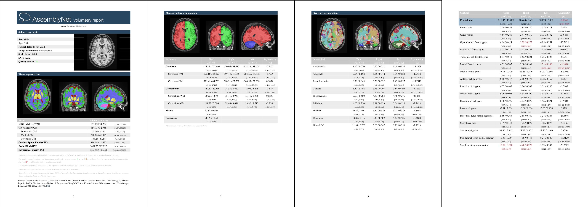

# AssemblyNet: 3D Whole Brain MRI Segmentation

This repository presents the Docker image of our whole brain segmentation pipeline: **AssemblyNet** [[paper]](https://dx.doi.org/10.1016/j.neuroimage.2020.117026).



Based on a large ensemble of convolution neural networks, **AssemblyNet** allows to segment a T1 MRI scan image in 133 labels, according to [BrainColor protocol](https://mindboggle.info/braincolor/).


Given an input T1 image in nifti format, this Docker image will produce segmentation images (in native and MNI spaces) of intracranial cavity, brain tissues, brain macrostructures, cortical lobes, and cortical and subcortical structures, and also a report and a csv file with segmented volumes and expected bounds (if age is provided).

Here are examples of produced segmentations (in MNI space): [structures](example/mni_structures_my_brain.nii.gz), [macrostructures](example/mni_macrostructures_my_brain.nii.gz), [tissues](example/mni_tissues_my_brain.nii.gz), [lobes](example/mni_lobes_my_brain.nii.gz), [intracranial cavity](example/mni_mask_my_brain.nii.gz) corresponding to this processed [T1 image](example/mni_t1_my_brain.nii.gz). Here are examples of produced PDF and CSV volumetry reports: [report.pdf](example/report_my_brain.pdf) and [report.csv](example/report_my_brain.csv).  

**This Docker image is to be used only for non-commercial and non-medical purposes (research only).** See [license](https://github.com/volBrain/AssemblyNet/blob/main/README.md#license).

If you use this Docker image, please cite:  
Pierrick Coupé, Boris Mansencal, Michaël Clément, Rémi Giraud, Baudouin Denis de Senneville, Vinh-Thong Ta, Vincent Lepetit, José V. Manjon  
[AssemblyNet: A large ensemble of CNNs for 3D whole brain MRI segmentation](https://dx.doi.org/10.1016/j.neuroimage.2020.117026).  
NeuroImage, Elsevier, 2020, 219, pp.117026. 
[[paper]](https://dx.doi.org/10.1016/j.neuroimage.2020.117026) [[bibtex]](doc/AssemblyNet.bib)


# Quick Start instructions

If you have already installed Docker, you can get the volbrain/assemblynet:1.0.0 image from Docker Hub repository:
```
sudo docker pull volbrain/assemblynet:1.0.0
```

If you have a NVIDIA GPU with at least 8GB, and have already installed NVIDIA Container Toolkit, you can run AssemblyNet on the GPU on the image /absolute/path/to/images/image.nii.gz:
```
sudo docker run --rm --gpus '"device=0"' -v /absolute/path/to/images:/data volbrain/assemblynet:1.0.0 /data/image.nii.gz
```

If you have a x86_64 CPU, you can run AssemblyNet on the CPU on the image /absolute/path/to/images/image.nii.gz:
```
sudo docker run --rm -v /absolute/path/to/images:/data volbrain/assemblynet:1.0.0 /data/image.nii.gz
```

See [Installation instructions](https://github.com/volBrain/AssemblyNet/blob/main/README.md#installation-instructions) for detailed instructions on how to install all the dependencies.  
See [How to use AssemblyNet](https://github.com/volBrain/AssemblyNet/blob/main/README.md#how-to-use-assemblynet) for detailed instructions on how to use AssemblyNet.


# Installation instructions 

## Prerequisites

To run this Docker image on a CPU, you will need:
* a x86_64 CPU 
* At least 6GB of RAM
* GNU/Linux [[supported distributions]](https://docs.docker.com/engine/install/#server) or Windows 10/11 with WSL [[supported versions]](https://docs.docker.com/desktop/windows/install/)
* Docker >= 19.03 
* AssemblyNet Docker image 
* MRI files in nifti format

To run this Docker image on a GPU, you will need:
* A NVIDIA GPU with at least 8GB and a [CUDA Compute capability](https://developer.nvidia.com/cuda-gpus#compute) >= 6.0 (that is a GPU from the NVIDIA Pascal, Volta, Turing, and Ampere Architecture GPU families. For example Titan Xp, V100, GeForce RTX 2080, Geforce RTX 3080, A40, ...)
* GNU/Linux x86_64 with kernel version > 3.10 (for example Ubuntu 16.04 or above) [[supported distributions]](https://docs.nvidia.com/datacenter/cloud-native/container-toolkit/install-guide.html#supported-platforms) or Windows 10/11 with WSL 2 [[supported versions]](https://docs.docker.com/desktop/windows/install/)
* NVIDIA drivers >= 418.xx with xx>=40, 440.xx with xx>=33, 450.xx with xx>=51, 460.xx with xx>=27 or 470.xx [[driver requirements]](https://docs.nvidia.com/deeplearning/frameworks/tensorflow-release-notes/rel_21-08.html#rel_21-08)
* Docker >= 19.03 
* NVIDIA Container Toolkit 
* AssemblyNet Docker image 
* MRI files in nifti format

## Installation 

Docker may be installed on supported versions of [GNU/Linux](https://github.com/volBrain/AssemblyNet/blob/main/README.md#installation-on-gnulinux) or [Windows 10/11 with WSL](https://github.com/volBrain/AssemblyNet/blob/main/README.md#installation-on-windows-1011-with-wsl). The docker image can also be transformed in a [Singularity image](https://github.com/volBrain/AssemblyNet/blob/main/README.md#singularity-image)

### Installation on GNU/Linux

Here are the detailled installation instructions on Ubuntu (18.04 or above).

#### Docker 

Install Docker from official repository [[instructions]](https://docs.docker.com/engine/install/ubuntu/).  
(Docker no longer releases updated packages for Ubuntu 16.04)
```
#Uninstall old versions of docker
sudo apt-get remove docker docker-engine docker.io containerd runc
#Install using the official repository
sudo apt-get update
sudo apt-get install apt-transport-https ca-certificates curl gnupg-agent software-properties-common
curl -fsSL https://download.docker.com/linux/ubuntu/gpg | sudo apt-key add -
sudo apt-key fingerprint 0EBFCD88
sudo add-apt-repository "deb [arch=amd64] https://download.docker.com/linux/ubuntu $(lsb_release -cs) stable"
sudo apt-get update
sudo apt-get install docker-ce docker-ce-cli containerd.io
#Verify that Docker Engine is installed correctly
sudo docker run hello-world
# it may download the hello-world docker image and then print "Hello from Docker!" and other information.
```

#### NVIDIA Driver [GPU-use only]

Install the proprietary NVIDIA driver. 

You need a NVIDIA driver version >= 418.xx with xx>=40, 440.xx with xx>=33, 450.xx with xx>=51, 460.xx with xx>=27 or 470.xx [[driver requirements]](https://docs.nvidia.com/deeplearning/frameworks/tensorflow-release-notes/rel_21-08.html#rel_21-08)

For exemple:
```
sudo apt install nvidia-driver-470
```


#### NVIDIA Container Toolkit [GPU-use only]

Install NVIDIA Container Toolkit (nvidia-docker2 package) from official repository [[instructions]](https://docs.nvidia.com/datacenter/cloud-native/container-toolkit/install-guide.html#docker)
```
distribution=$(. /etc/os-release;echo $ID$VERSION_ID) \
   && curl -s -L https://nvidia.github.io/nvidia-docker/gpgkey | sudo apt-key add - \
   && curl -s -L https://nvidia.github.io/nvidia-docker/$distribution/nvidia-docker.list | sudo tee /etc/apt/sources.list.d/nvidia-docker.list
sudo apt-get update
sudo apt-get install -y nvidia-docker2
sudo systemctl restart docker
#Verify that Docker can access the GPU with:
sudo docker run --rm --gpus all nvidia/cuda:11.0-base nvidia-smi
# it may download the nvidia/cuda:11.0-base docker image and then run nvidia-smi from inside the docker without any error.
```

For other linux distributions, see [NVIDIA Container Toolkit installation instructions](https://docs.nvidia.com/datacenter/cloud-native/container-toolkit/install-guide.html#docker).


#### AssemblyNet Docker image 

Pull the volbrain/assemblynet:1.0.0 image from Docker Hub repository:

```
sudo docker pull volbrain/assemblynet:1.0.0
```

See [How to use AssemblyNet](https://github.com/volBrain/AssemblyNet/blob/main/README.md#how-to-use-assemblynet).


### Installation on Windows 10/11 with WSL

Here are the detailled installation instructions on Windows 10 or 11.

#### Check Windows version

You need:
* Windows 10 64-bit: Home or Pro 2004 (build 19041) or higher, or Enterprise or Education 1909 (build 18363) or higher.
* Windows 11 64-bit: Home or Pro version 21H2 or higher, or Enterprise or Education version 21H2 or higher.

To check your Windows version and build number, select Windows logo key + R, type winver, select OK. 
You can update to the latest Windows version by selecting Start > Settings > Windows Update > Check for updates.

#### Enable BIOS virtualization support

BIOS-level hardware virtualization support must be enabled.

You can check the Performance tab on the Task Manager to see if virtualization is enabled, see [virtualization support](https://docs.docker.com/desktop/windows/troubleshoot/#virtualization-must-be-enabled).

#### WSL2

Install Windows Subsystem for Linux (WSL) 2 [[instructions]](https://docs.microsoft.com/en-us/windows/wsl/install)

Open PowerShell as Administrator (Start menu > PowerShell > right-click > Run as Administrator) and enter this command:
```
wsl --install
```
It should install the last Ubuntu LTS. You may need to reboot your machine.

You can check that WSL version 2 was installed:
Open PowerShell as Administrator (Start menu > PowerShell > right-click > Run as Administrator) and enter this command:
```
wsl -l -v
```

Launch Ubuntu (Start menu > ubuntu). It should ask to create a default user. 
You may upgrade the system: 
```
sudo apt-get update
sudo apt-get upgrade
```

#### Docker Desktop

Install Docker Desktop [[instructions]](https://docs.docker.com/desktop/windows/wsl/).

Download [Docker Desktop 2.3+](https://desktop.docker.com/win/main/amd64/Docker%20Desktop%20Installer.exe) and follow the installation instructions.
Use of WSL 2 backend should be enabled by default during installation if WSL 2 was correctly installed.

You have to log off and log in again to be able to use Docker Desktop.

If your admin account is different to your user account, you must add the user to the docker-users group. Run Computer Management as an administrator and navigate to Local Users and Groups > Groups > docker-users. Right-click to add the user to the group. Log out and log back in for the changes to take effect.

If you have an Nvidia GPU, you can verify that Docker can access the GPU.
Launch Ubuntu and run:
```
docker run --rm --gpus all nvidia/cuda:11.0-base nvidia-smi
# it may download the nvidia/cuda:11.0-base docker image and then run nvidia-smi from inside the docker without any error.
```

#### AssemblyNet Docker image 

From the Ubuntu terminal, pull the volbrain/assemblynet:1.0.0 image from Docker Hub repository:
```
sudo docker pull volbrain/assemblynet:1.0.0
```

See [How to use AssemblyNet](https://github.com/volBrain/AssemblyNet/blob/main/README.md#how-to-use-assemblynet).


# How to use AssemblyNet 

## Inputs

This Docker image requires images in nifti format (.nii or .nii.gz) as inputs.

To convert your DICOM files into nifti format, you can use [dcm2niix](https://github.com/rordenlab/dcm2niix), a multiplatform and open source software.


## Outputs

For each processed image, the following files will be produced (where *filename* is replaced by the original filename):

* native_t1_*filename*.nii.gz and mni_t1_*filename*.nii.gz: filtered and normalized T1 image in native space and in MNI space
* native_mask_*filename*.nii.gz and mni_mask_*filename*.nii.gz: Intracranial Cavity mask image in native space and in MNI space
* native_tissues_*filename*.nii.gz and mni_tissues_*filename*.nii.gz: tissues segementation in native space and in MNI space
* native_macrostructures_*filename*.nii.gz and mni_macrostructures_*filename*.nii.gz: macrostructures segementation in native space and in MNI space
* native_lobes_*filename*.nii.gz and mni_lobes_*filename*.nii.gz: lobes segementation in native space and in MNI space
* native_strctures_*filename*.nii.gzand mni_strctures_*filename*.nii.gz: structures segementation in native space and in MNI space
* matrix_affine_native_to_mni_*filename*.txt: ITK transformation matrix from native to MNI space
* report_*filename*.pdf: PDF format volumetry report. The reports will show the expected limits/normative bounds of normalized volumes in function of age, if age and optionally sex were specified.
* report_*filename*.csv: CSV format volumetry report
* README.pdf: README with this information and the labels correspondance.

The reports include a Quality Control rating based on RegQCNET [1]. 

[1]
Baudouin Denis de Senneville, José V. Manjon, Pierrick Coupé,  
[RegQCNET: Deep quality control for image-to-template brain MRI affine registration](https://iopscience.iop.org/article/10.1088/1361-6560/abb6be/meta).  
Physics in Medicine & Biology, Volume 65, Number 22.

The size of the ouput files on disk is roughly 7.5 times the input size (for compressed nii files).

## Command options

The Docker image has the following arguments: 
```
[-age <age>] [-sex <sex>] [-age-sex-csv input_csv_filename] [-recursive] [-pattern-t1 <pattern>] [-no-pdf-report] [-global-csv output_csv_filename] [-batch-size <batchSize>] <input image or directory> [output directory]
```

* `<input image or directory>`: it is possible to process a single image or all the images in an input directory. 
* `<output directory>`: it is also possible to specify an output directory where the produced files will be saved. 
* `[-age <age>]` and `[-sex <sex>]` allows to specify age and sex. Sex must be "Male" or "Female". Age is the age in years and should be a float. If an age is specified, the produced volumetry report report_*filename*.pdf will show the expected limits/normative bounds of normalized volumes in function of age. If both age and sex are specified, the expected limits of normalized volumes will be in function of age and sex. These bounds have been estimated over more than 3000 cognitively normal subjects. In case of abnormality, red values indicate volumes lower or bigger than normal at 95%. These options are mainly useful when processing exactly one image (see `-age-sex-csv` when processing several images).
* `-age-sex-csv <input_csv_filename>`: specify input CSV filename with age and sex for all the input files when processing several files. The CSV file should have at least three columns: filename, age and sex, separated by commas. The first row of the csv should start with "#" and contain the columns names. In the filename column, each filename should contain the relative path of a file in the input directory. 
* `[-recursive]`: allows to specify that images will be searched recursively in input directory. 
* `[-pattern-t1 <pattern>]`: allows to specify a pattern for images searched in input directory. The default is: \*.nii\*
* `[-no-pdf-report]`: specify to produce no PDF format volumetry report.
* `[-global-csv <output_csv_filename>]`: allows to have all the volumetry information in a unique CSV file.
* `[-batch-size <batchSize>]`: allows to speciy the batch size (an integer) of T1 images processed simultaneously. When processing several images, increasing the batch size may reduce the total processing time (see [Processing time](https://github.com/volBrain/AssemblyNet/blob/main/README.md#processing_time)) at the cost of more memory usage (mainly CPU memory). It is recommanded to use the largest batch size that fits in your CPU & GPU memory. Default batch size is set to 3.


## Exemples of commands


The following command run AssemblyNet on first GPU (0) on the image /absolute/path/to/images/image.nii.gz:  
```
sudo docker run --rm --gpus '"device=0"' -v /absolute/path/to/images:/data volbrain/assemblynet:1.0.0 /data/image.nii.gz
```

- "/absolute/path/to/images" should be changed to the absolute path of your image. This path must only contain these letters `[a-zA-Z0-9][a-zA-Z0-9_.-]`.
- You can pass `.nii` or `.nii.gz` files
- If you have multiple GPUs, you can change the GPU used to run AssemblyNet by changing the GPU indice set. '"device=2"' for third GPU for example. This Docker image uses only one GPU.
- The produced output files will be in the same directory than the input image.

In the same way, the following command run AssemblyNet on CPU on the image /absolute/path/to/images/image.nii
```
sudo docker run --rm -v /absolute/path/to/images:/data volbrain/assemblynet:1.0.0 /data/image.nii
```

You can also process all the images in an input directory and produce the output files in an output directory, here on first GPU:
```
sudo docker run --rm --gpus '"device=0"' -v /absolute/input/path/to/images:/data -v /absolute/output/path:/data_out volbrain/assemblynet:1.0.0 /data /data_out
```

`sudo` may be omitted if the user is member of the docker group.


Here is an example of command to run AssemblyNet on first GPU, specifying age and gender of subject to have normality bounds:  
```
sudo docker run --rm --gpus '"device=0"' -v /absolute/path/to/images:/data volbrain/assemblynet:1.0.0 -age 50 -sex Male /data/image.nii.gz
```
If you only have one gpu, you can also specify `--gpus all` instead of `--gpus '"device=0"'`.

Here is an example of command to run AssemblyNet on first GPU on all the T1.nii images recursively found in input directory `/absolute/path/to/images`, produce a global csv file, and save ouptut files in `/absolute/path/to/output/directory`:
```
sudo docker run --rm --gpus '"device=0"' -v /absolute/path/to/images:/data -v /absolute/path/to/output/directory:/data_out volbrain/assemblynet:1.0.0 -recursive -pattern-t1 T1.nii -global-csv /data_out/global_volumetry_info.csv /data/ /data_out/
```

Here is an example of command to run AssemblyNet on first GPU on all the T1*.nii* images recursively found in input directory `/absolute/path/to/images`, to use a csv filename to specify age and sex, to produce a global csv file and no pdf report, to use a batch size of 8 and save ouptut files in `/absolute/path/to/output/directory`:
```
sudo docker run --rm --gpus '"device=0"' -v /absolute/path/to/images:/data -v /absolute/path/to/output/directory:/data_out volbrain/assemblynet:1.0.0 -recursive -pattern-t1 "T1*.nii*" -age-sex-csv /data/age_sex.csv -global-csv /data_out/global_volumetry_info.csv -no-pdf-report -batch-size 8 /data/ /data_out/
```

If there are sub-directories in the input dir (in particular when -recursive is used) and an output directory is specified, these sub-directories will be created in the output directory. This is for example a way to process a [BIDS](https://bids.neuroimaging.io/) directory.

Processing time should around 7-15mn/image depending on the hardware configuration (See [Processing time](https://github.com/volBrain/AssemblyNet/blob/main/README.md#processing_time)).

The produced ouput files will be own by root. You may change ownership with `sudo chown -R $(id -u) output_file_or_directory`.
If you run docker with `--user $(id -u):$(id -g)`  the created files will have the current user as owner, however, on linux, docker will only run on CPU.

AssemblyNet is not fully deterministic: you may have slight differences in the produced segmentations between runs.


# Singularity image 

To use this docker image without root privileges (on a HPC cluster for example), you can transform the docker image in a singularity image with the following command:
```
singularity build assemblynet_1.0.0.sif docker://volbrain/assemblynet:1.0.0
```

You can then use the singularity image with the following command to process a single image (and output the produced files in the same directory):
```
singularity run --nv -B <your_tmp_dir>:/tmp -B <your_data_dir>:/data <path_to_singularity_image>/assemblynet_1.0.0.sif /data/<your_nii_image>
```
or to process a whole directory (and output the produced files in a new ouput directory):
```
singularity run --nv -B <your_tmp_dir>:/tmp -B <your_data_dir>:/data <your_data_out_dir>:/data_out <path_to_singularity_image>/assemblynet_1.0.0.sif -recursive /data /data_out
```
The option `--nv` enables GPU support. You may have to set the environment variable [SINGULARITYENV_CUDA_VISIBLE_DEVICES](https://sylabs.io/guides/main/user-guide/gpu.html#gpu-selection) to choose which GPU to use.

Depending on how your computer is set up, you may also have to specify a temporary home directory, with for example:  `-H <a_tmp_dir>:/data` (for example to prevent finding local python packages).

See [command options](https://github.com/volBrain/AssemblyNet/blob/main/README.md#command-options) for other command arguments.


# Processing time

The following tables list AssemblyNet processing time for one or several images when running on CPU or GPU.
Each time, the batch size is set to be equal to the number of images.


Config1:  
 CPU: Intel Core i9-7940x  
 GPU: Nvidia Titan Xp 12GB  
 RAM: 128GB  
 DISK: SATA
 OS: Ubuntu 20.04  

On GPU:

| # images   | total time | time per image |
| ---------- | ---------- | -------------- |
|  1 image   |  14m48s    |  888s/img      |
|  2 images  |  21m02s    |  631s/img      |
|  4 images  |  33m15s    |  499s/img      |
|  8 images  |  58m34s    |  440s/img      |
| 12 images  |  82m06s    |  411s/img      |
| 16 images  | 108m21s    |  407s/img      |

On CPU:

| # images   | total time | time per image |
| ---------- | ---------- | -------------- |
|  1 image   |  16m32s    |  992s/img      |
|  2 images  |  27m48s    |  834s/img      |
|  4 images  |  46m42s    |  699s/img      |
|  8 images  |  87m32s    |  657s/img      |
| 12 images  | 127m40s    |  638s/img      |
| 16 images  | 169m10s    |  635s/img      |


Config2  
 CPU: AMD 5800X  
 GPU: RTX 3800  
 RAM: 64GB 
 DISK: NVMe SSD
 OS: Windows 10 - WSL2 (Ubuntu 20.04)  

On GPU:

| # images   | total time | time per image |
| ---------- | ---------- | -------------- |
|  1 image   |   6m42s    |  402s/img      |
|  2 images  |   9m17s    |  279s/img      |
|  4 images  |  15m03s    |  226s/img      |
|  8 images  |  26m40s    |  200s/img      |
| 12 images  |  38m11s    |  191s/img      |

On CPU:

| # images   | total time | time per image |
| ---------- | ---------- | -------------- |
|  1 image   |  11m37s    |  697s/img      |
|  2 images  |  20m03s    |  601s/img      |
|  4 images  |  37m51s    |  568s/img      |
|  8 images  |  72m16s    |  542s/img      |
| 12 images  | 112m08s    |  561s/img      |


According to our benchmarks, disk access speed has more impact on processing time than GPU performance.
If possible, it is recommended to store both the Docker image and the T1 images on a SSD disk.

# License

**This Docker image is to be used only for non-commercial and non-medical purposes (research only).**

The code and Docker are free for non-commercial purposes. [license.txt](license.txt) shows the terms for commercial and for-profit purposes.

As this Docker image uses CUDA for GPU support, you must agreee to [CUDA End User License Agreement](https://docs.nvidia.com/cuda/eula/index.html#abstract).  
Internally, this docker uses binaries of [SPM8](https://www.fil.ion.ucl.ac.uk/spm/software/spm8/), [N4ITK](), [ANTs](https://github.com/ANTsX/ANTs).


